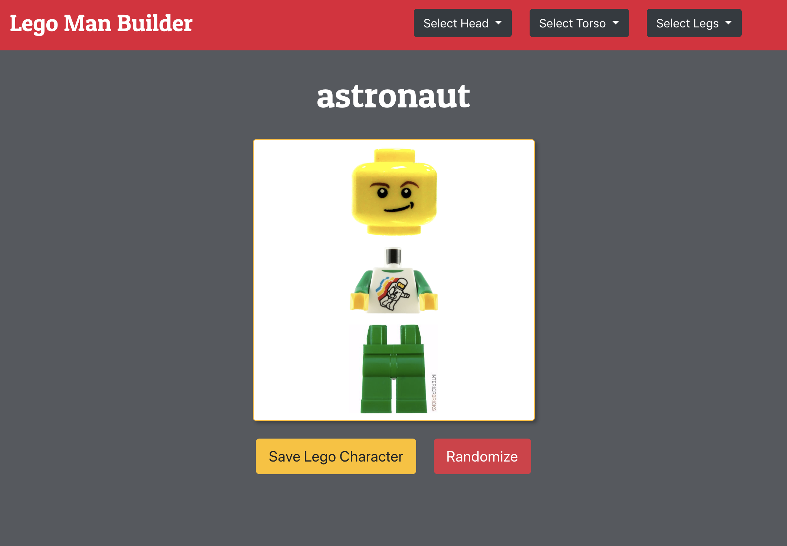
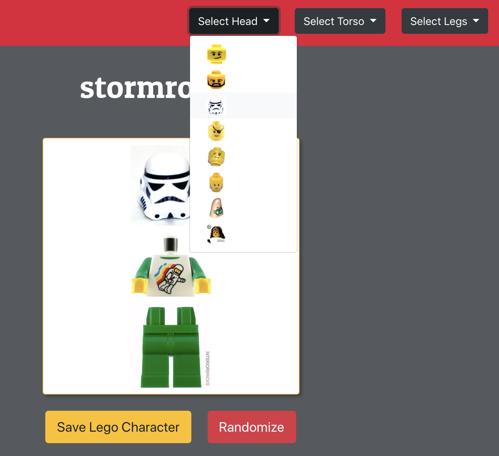
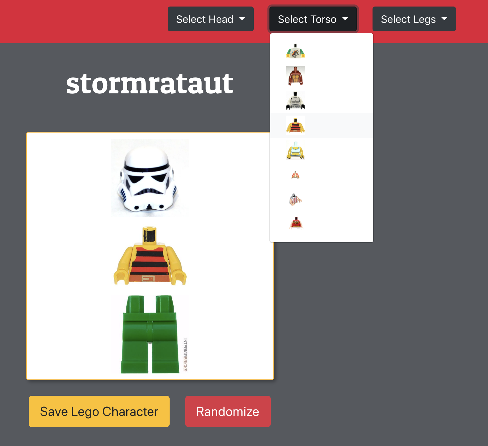
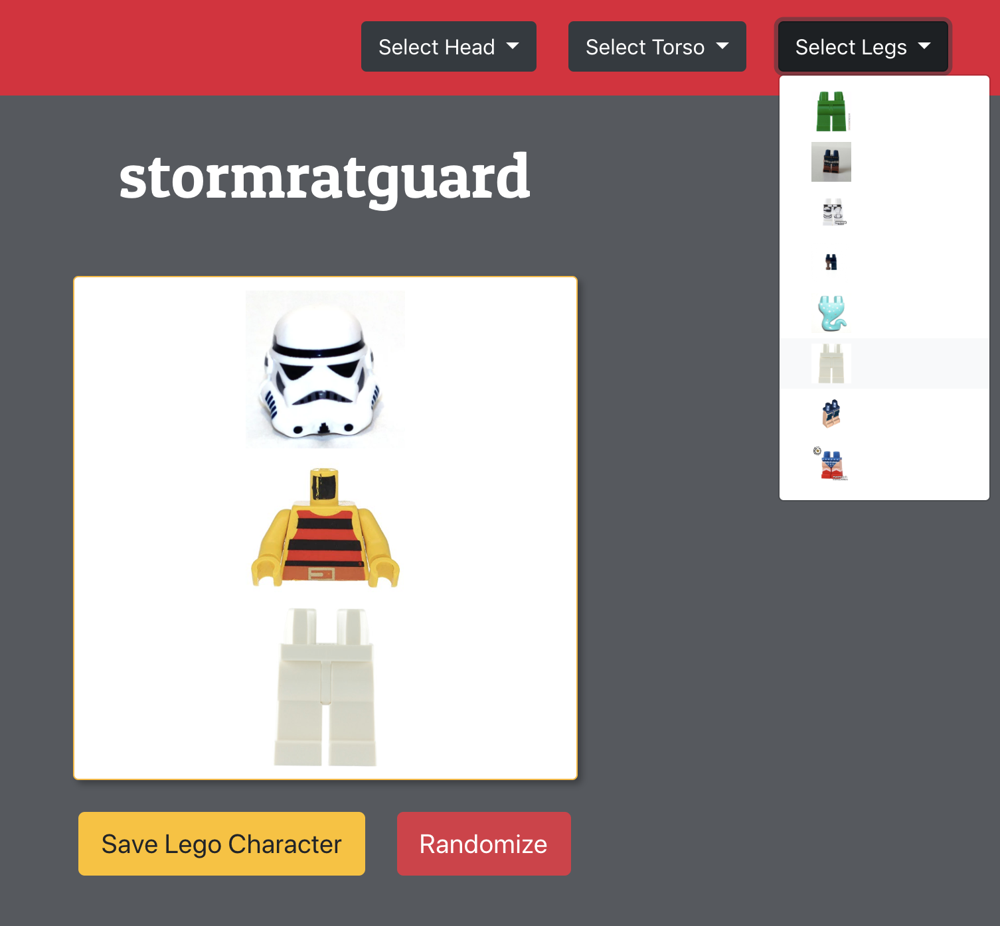
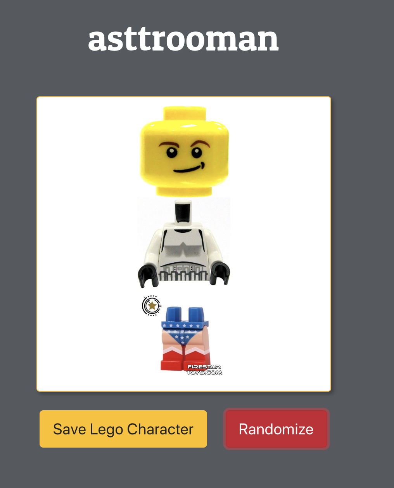
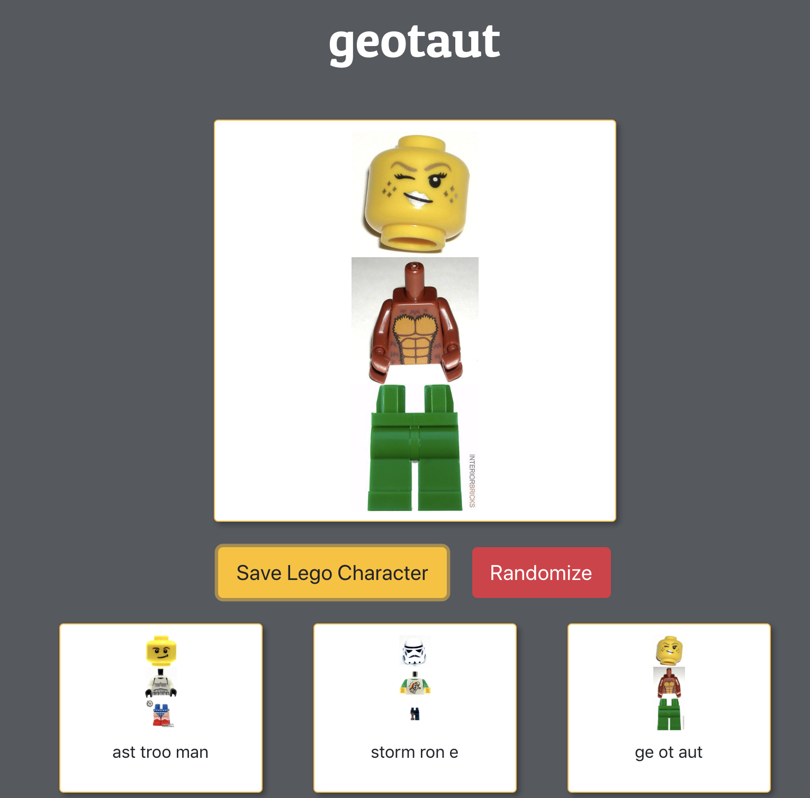

# Lego Man Builder

## Description
This is a small lego man builder app. The user has the ability to make a lego person creation, randomize a lego person, or save individual lego characters. The name of the lego person creation corresponds to each lego piece chosen. As user swaps out lego parts, the name will change to reflect the piece swaps.

This project is an exploration of ES6 Modules, Axios, Promises and SASS styling.

## Technologies Used
* SASS
* Bootstrap
* Webpack
* Axios
* Firebase
* ES6 Modules

## How to run this app
Note: To run this app you will need a firebase account and a new project.

### 1. Configure Firebase
1. Clone the repository to your local machine.
2. Run the following command in terminal to download the web dependencies: `npm install`
3. In the db folder, rename apiKeys.json.example to apiKeys.json.
4. In Firebase, create a new project.
5. Navigate to your config object, and copy the keys from Firebase into the apiKeys.json file.
6. Create a realtime databse in Firebase, and start in test mode.
7. Import the `./db/parts.json` file into the database to seed data.

### 2. Serve up the app
* Run `npm start` in your terminal to initiate the app.
