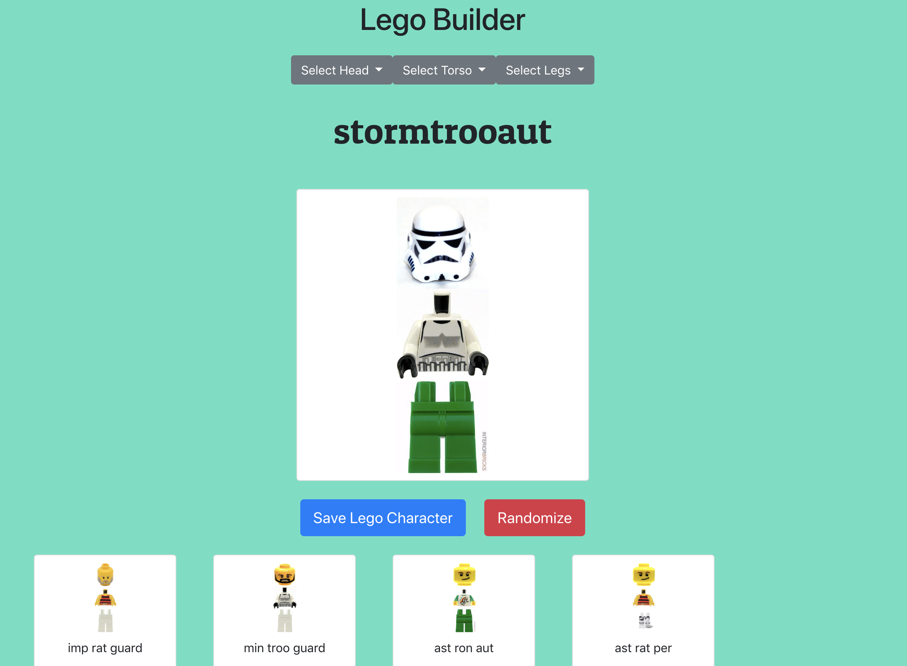

# Lego Builder

### Description
This project is an exploration of ES6 Modules, Axios, Promises and SASS styling by creating a Lego Builder. Once loaded the user has the ability to create lego creations, save the lego creations, or have a lego creation completely randomized.



### Technologies Used
* SASS
* Webpack
* Axios
* Firebase
* ES6 Modules

### How to run this app
To run this app you will need a firebase account and a new project.

Configure Firebase
in the db folder, rename apiKeys.json.example to apiKeys.json
Add in the config object from your firebase project
Serve up the app
At the root of the project: npm install
npm start

1.  Serving up the json data
* globally install json-server: `npm install -g json-server`
* use npm to run the json: `npm run data`

2.  Serve up the app
* At the root of the project: `npm install`
* `npm start`

### Serve up the app
At the root of the project: 
```
npm install
npm start
```
